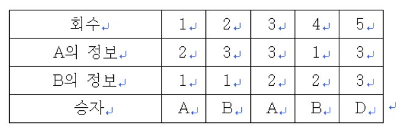
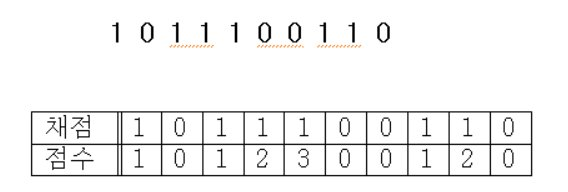
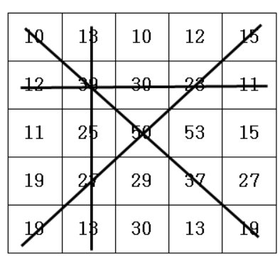
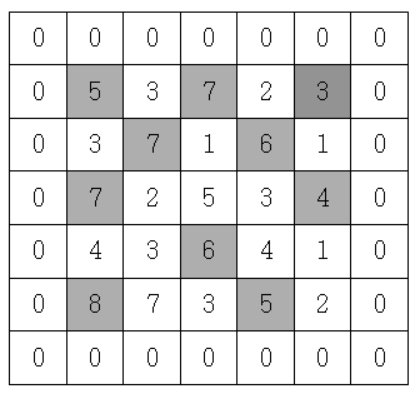
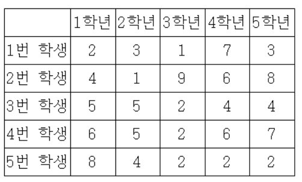

## Java

### Section1_String(문자열)
1. 한 개의 문자열을 입력받고, 특정 문자를 입력받아 해당 특정문자가 입력받은 문자열에 몇 개 존재하는지 알아내는 프로그램을 작성하세요.

2. 대문자와 소문자가 같이 존재하는 문자열을 입력받아 대문자는 소문자로 소문자는 대문자로 변환하여 출력하는 프로그램을 작성하세요.

3. 한 개의 문장이 주어지면 그 문장 속에서 가장 긴 단어를 출력하는 프로그램을 작성하세요. 문장속의 각 단어는 공백으로 구분됩니다. 
첫 줄에 가장 긴 단어를 출력한다. 가장 길이가 긴 단어가 여러개일 경우 문장속에서 가장 앞쪽에 위치한 단어를 답으로 한다.

4. N개의 단어가 주어지면 각 단어를 뒤집어 출력하는 프로그램을 작성하세요.

5. 영어 알파벳과 특수문자로 구성된 문자열이 주어지면 영어 알파벳만 뒤집고, 특수문자는 자기 자리에 그대로 있는 문자열을 만들어 출력하는 프로그램을 작성하세요.

6. 소문자로 된 한개의 문자열이 입력되면 중복된 문자를 제거하고 출력하는 프로그램을 작성하세요. 중복이 제거된 문자열의 각 문자는 원래 문자열의 순서를 유지합니다.

7. 앞에서 읽을 때나 뒤에서 읽을 때나 같은 문자열을 회문 문자열이라고 합니다. 
문자열이 입력되면 해당 문자열이 회문 문자열이면 "YES", 회문 문자열이 아니면 “NO"를 출력하는 프로그램을 작성하세요. 단 회문을 검사할 때 대소문자를 구분하지 않습니다.

8. 앞에서 읽을 때나 뒤에서 읽을 때나 같은 문자열을 팰린드롬이라고 합니다. 문자열이 입력되면 해당 문자열이 팰린드롬이면 "YES", 아니면 “NO"를 출력하는 프로그램을 작성하세요. 단 회문을 검사할 때 알파벳만 가지고 회문을 검사하며, 대소문자를 구분하지 않습니다. 알파벳 이외의 문자들의 무시합니다.

9. 문자와 숫자가 섞여있는 문자열이 주어지면 그 중 숫자만 추출하여 그 순서대로 자연수를 만듭니다.
만약 “tge0a1h205er”에서 숫자만 추출하면 0, 1, 2, 0, 5이고 이것을 자연수를 만들면 1205이 됩니다. 추출하여 만들어지는 자연수는 100,000,000을 넘지 않습니다.

10. 한 개의 문자열 s와 문자 t가 주어지면 문자열 s의 각 문자가 문자 t와 떨어진 최소거리를 출력하는 프로그램을 작성하세요.

11. 알파벳 대문자로 이루어진 문자열을 입력받아 같은 문자가 연속으로 반복되는 경우 반복되는 문자 바로 오른쪽에 반복 횟수를 표기하는 방법으로 문자열을 압축하는 프로그램을 작성하시오. 단 반복횟수가 1인 경우 생략합니다.

12. 현수는 영희에게 알파벳 대문자로 구성된 비밀편지를 매일 컴퓨터를 이용해 보냅니다.

    비밀편지는 현수와 영희가 서로 약속한 암호로 구성되어 있습니다.

    비밀편지는 알파벳 한 문자마다 # 또는 *이 일곱 개로 구성되어 있습니다.

    만약 현수가 “#*****#”으로 구성된 문자를 보냈다면 영희는 현수와 약속한 규칙대로 다음과 같이 해석합니다.

    1.“#*****#”를 일곱자리의 이진수로 바꿉니다. #은 이진수의 1로, *이진수의 0으로 변환합니다. 결과는 “1000001”로 변환됩니다.

    2.바뀐 2진수를 10진수화 합니다. “1000001”을 10진수화 하면 65가 됩니다.

    3.아스키 번호가 65문자로 변환합니다. 즉 아스크번호 65는 대문자 'A'입니다.

    참고로 대문자들의 아스키 번호는 'A'는 65번, ‘B'는 66번, ’C'는 67번 등 차례대로 1씩 증가하여 ‘Z'는 90번입니다.

<!--현수가 4개의 문자를 다음과 같이 신호로 보냈다면

 #****###**#####**#####**##**

이 신호를 4개의 문자신호로 구분하면

#****## -> 'C'

#**#### -> 'O'

#**#### -> 'O'

#**##** -> 'L'

최종적으로 “COOL"로 해석됩니다. -->

***

### Section2_Array
1. N개의 정수를 입력받아, 자신의 바로 앞 수보다 큰 수만 출력하는 프로그램을 작성하세요.

2. 선생님이 N명의 학생을 일렬로 세웠습니다. 일렬로 서 있는 학생의 키가 앞에서부터 순서대로 주어질 때, 맨 앞에 서 있는 선생님이 볼 수 있는 학생의 수를 구하는 프로그램을 작성하세요. (앞에 서 있는 사람들보다 크면 보이고, 작거나 같으면 보이지 않습니다.)

3. A, B 두 사람이 가위바위보 게임을 합니다. 총 N번의 게임을 하여 A가 이기면 A를 출력하고, B가 이기면 B를 출력합니다. 비길 경우에는 D를 출력합니다.
가위, 바위, 보의 정보는 1:가위, 2:바위, 3:보로 정하겠습니다.
예를 들어 N=5이면

    

    두 사람의 각 회의 가위, 바위, 보 정보가 주어지면 각 회를 누가 이겼는지 출력하는 프로그램을 작성하세요.

4.  피보나키 수열을 출력한다. 피보나치 수열이란 앞의 2개의 수를 합하여 다음 숫자가 되는 수열이다. (입력은 피보나치 수열의 총 항의 수 이다. 만약 7이 입력되면 1 1 2 3 5 8 13을 출력하면 된다.)

5. 자연수 N이 입력되면 1부터 N까지의 소수의 개수를 출력하는 프로그램을 작성하세요. 만약 20이 입력되면 1부터 20까지의 소수는 2, 3, 5, 7, 11, 13, 17, 19로 총 8개입니다.

6. N개의 자연수가 입력되면 각 자연수를 뒤집은 후 그 뒤집은 수가 소수이면 그 소수를 출력하는 프로그램을 작성하세요.

    예를 들어 32를 뒤집으면 23이고, 23은 소수이다. 그러면 23을 출력한다. 단 910를 뒤집으면 19로 숫자화 해야 한다.

    첫 자리부터의 연속된 0은 무시한다.

7. OX 문제는 맞거나 틀린 두 경우의 답을 가지는 문제를 말한다.

    여러 개의 OX 문제로 만들어진 시험에서 연속적으로 답을 맞히는 경우에는 가산점을 주기 위해서 다음과 같이 점수 계산을 하기로 하였다.

    1번 문제가 맞는 경우에는 1점으로 계산한다. 앞의 문제에 대해서는 답을 틀리다가 답이 맞는 처음 문제는 1점으로 계산한다.

    또한, 연속으로 문제의 답이 맞는 경우에서 두 번째 문제는 2점, 세 번째 문제는 3점, ..., K번째 문제는 K점으로 계산한다. 틀린 문제는 0점으로 계산한다.

    예를 들어, 아래와 같이 10 개의 OX 문제에서 답이 맞은 문제의 경우에는 1로 표시하고, 틀린 경우에는 0으로 표시하였을 때,

    점수 계산은 아래 표와 같이 계산되어, 총 점수는 1+1+2+3+1+2=10 점이다.

    

    시험문제의 채점 결과가 주어졌을 때, 총 점수를 계산하는 프로그램을 작성하시오.

8. N명의 학생의 국어점수가 입력되면 각 학생의 등수를 입력된 순서대로 출력하는 프로그램을 작성하세요.

    같은 점수가 입력될 경우 높은 등수로 동일 처리한다.

    즉 가장 높은 점수가 92점인데 92점이 3명 존재하면 1등이 3명이고 그 다음 학생은 4등이 된다.

9. 5*5 격자판에 아래롸 같이 숫자가 적혀있습니다.

    

    N*N의 격자판이 주어지면 각 행의 합, 각 열의 합, 두 대각선의 합 중 가 장 큰 합을 출력합니다.

10. 지도 정보가 N*N 격자판에 주어집니다. 각 격자에는 그 지역의 높이가 쓰여있습니다.

    각 격자판의 숫자 중 자신의 상하좌우 숫자보다 큰 숫자는 봉우리 지역입니다. 봉우리 지역이 몇 개 있는 지 알아내는 프로그램을 작성하세요.

    격자의 가장자리는 0으로 초기화 되었다고 가정한다.

    

11. 김갑동 선생님은 올해 6학년 1반 담임을 맡게 되었다.

    김갑동 선생님은 우선 임시로 반장을 정하고 학생들이 서로 친숙해진 후에 정식으로 선거를 통해 반장을 선출하려고 한다.

    그는 자기반 학생 중에서 1학년부터 5학년까지 지내오면서 한번이라도 같은 반이었던 사람이 가장 많은 학생을 임시 반장으로 정하려 한다.

    그래서 김갑동 선생님은 각 학생들이 1학년부터 5학년까지 몇 반에 속했었는지를 나타내는 표를 만들었다.

    예를 들어 학생 수가 5명일 때의 표를 살펴보자.

     

    위 경우에 4번 학생을 보면 3번 학생과 2학년 때 같은 반이었고, 3번 학생 및 5번 학생과 3학년 때 같은 반이었으며,

    2번 학생과는 4학년 때 같은 반이었음을 알 수 있다. 그러므로 이 학급에서 4번 학생과 한번이라도

    같은 반이었던 사람은 2번 학생, 3번 학생과 5번 학생으로 모두 3명이다.

    이 예에서 4번 학생이 전체 학생 중에서 같은 반이었던 학생 수가 제일 많으므로 임시 반장이 된다.

    각 학생들이 1학년부터 5학년까지 속했던 반이 주어질 때, 임시 반장을 정하는 프로그램을 작성하시오.

12. 현수네 반 선생님은 반 학생들의 수학점수를 향상시키기 위해 멘토링 시스템을 만들려고 합니다.

    멘토링은 멘토(도와주는 학생)와 멘티(도움을 받는 학생)가 한 짝이 되어 멘토가 멘티의 수학공부를 도와주는 것입니다.

    선생님은 M번의 수학테스트 등수를 가지고 멘토와 멘티를 정합니다.

    만약 A학생이 멘토이고, B학생이 멘티가 되는 짝이 되었다면, A학생은 M번의 수학테스트에서 모두 B학생보다 등수가 앞서야 합니다.

    M번의 수학성적이 주어지면 멘토와 멘티가 되는 짝을 만들 수 있는 경우가 총 몇 가지 인지 출력하는 프로그램을 작성하세요.

### Section3_TwoPointersAndSlidingWindow
1. 오름차순으로 정렬이 된 두 배열이 주어지면 두 배열을 오름차순으로 합쳐 출력하는 프로그램을 작성하세요.

2. A, B 두 개의 집합이 주어지면 두 집합의 공통 원소를 추출하여 오름차순으로 출력하는 프로그램을 작성하세요.

3. 현수의 아빠는 제과점을 운영합니다. 현수 아빠는 현수에게 N일 동안의 매출기록을 주고 연속된 K일 동안의 최대 매출액이 얼마인지 구하라고 했습니다.

    만약 N=10이고 10일 간의 매출기록이 아래와 같습니다. 이때 K=3이면

    12 1511 20 2510 20 19 13 15

    연속된 3일간의 최대 매출액은 11+20+25=56만원입니다.

4. N개의 수로 이루어진 수열이 주어집니다.

    이 수열에서 연속부분수열의 합이 특정숫자 M이 되는 경우가 몇 번 있는지 구하는 프로그램을 작성하세요.

    만약 N=8, M=6이고 수열이 다음과 같다면

    1 2 1 3 1 1 1 2

    합이 6이 되는 연속부분수열은 {2, 1, 3}, {1, 3, 1, 1}, {3, 1, 1, 1}로 총 3가지입니다.

